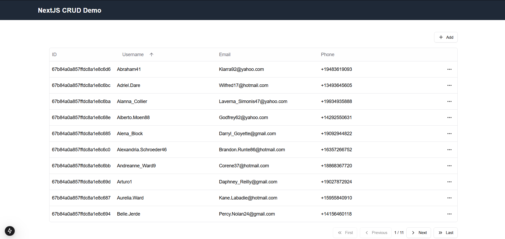
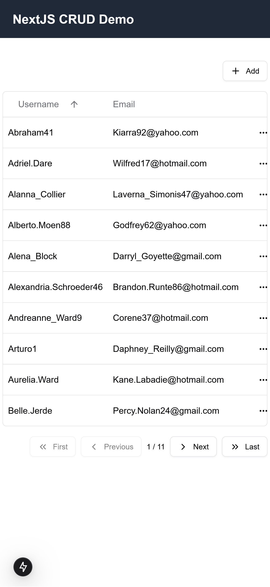
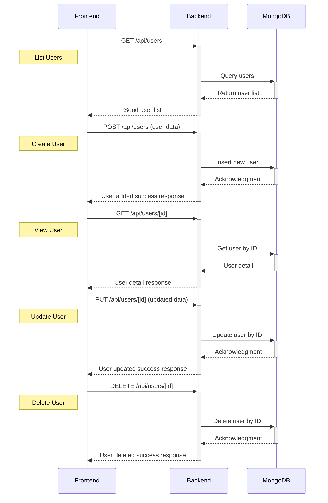

# NextJS CRUD Demo

This is a CRUD demo project using Next.js.

## Features

* ✅ NextJS
* ✅ MongoDB
* ✅ Responsive (Tailwind CSS / Shadcn / TanStack)
* ✅ CRUD
* ✅ REST API

## Screenshots

| Desktop                    | Mobile                    |
|----------------------------|---------------------------|
|||

## Video Demo


## Sequence Diagram



## Running

**Prerequisites**
* ☑️[Docker](https://www.docker.com/)
* ☑️Docker Compose

Current demo is setup to run on *docker compose* environment. With built docker image and containerized Mongo DB.

To run:

```shell
docker compose up -d
```

Then browse to [http://localhost:3000](http://localhost:3000) to test the demo.

## Development

1. Devcontainer (Preferred)

A VSCode [devcontainer](https://marketplace.visualstudio.com/items?itemName=ms-vscode-remote.remote-containers) is setup with a nodejs ready development environment. 

```shell
code .
```

If devcontainer extension is installed VSCode will prompt to open the project with devcontainer.

After devcontainer is started, we can continue to install shadcn

2. NodeJS Environment

Current development is run on NodeJS v22. Either installing manually or maintain nodejs version with NVM.

## Installing Shadcn

[Shadcn](https://github.com/shadcn-ui/ui) is a collection of reusable and customizable UI components library.

To install

```shell
## installing the command line
npx shadcn@latest init

## installing components used in the project
shadcn add button dropdown-menu input popover skeleton table
```


## Seeding DB

To seed the DB

```shell
# update app/scripts/seed.ts and change number of records
yarn seed
```
